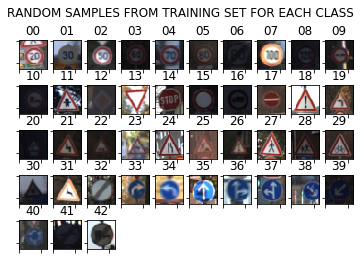
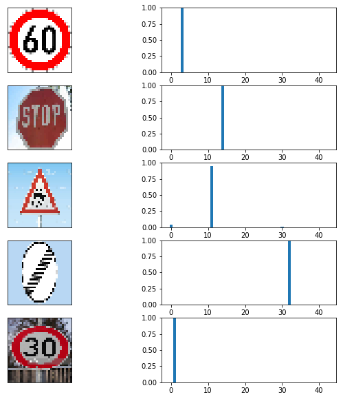

# Project2: Traffic Sign Recognition

## Objective

The goals of this project are to build a traffic sign recognition system, and detail steps are the following:
* Load the data set (see below for links to the project data set)
* Explore, summarize and visualize the data set
* Design, train and test a model architecture
* Use the model to make predictions on new images
* Analyze the softmax probabilities of the new images
* Summarize the results with a written report


You're reading it and here is a link to my [project code](https://github.com/BeSlower/Self-Driving-Car/blob/master/Project_2_traffic_sign_classification/Traffic_Sign_Classifier.ipynb)

## Data Set Summary & Exploration

I used the numpy library to calculate and summary the traffic signs data set:

* The size of training set is 34799
* The size of the validation set is 4410
* The size of test set is 12630
* The shape of a traffic sign image is (32, 32, 3)
* The number of unique classes/labels in the data set is 43

Some sample images:
<div align=center>

</div>

In addition, I used the matplotlib to visulize the distribution of each class in training set, validition set, and testing set. The figure is shown below:
<div align=center>

</div>
From the distribution figure, we can see the unbalanced problem among different image classes, but fortunately, the distribution patterns are very similar between training set and testing set.

## Design and Test a Model Architecture

### 1. Image Preprocessing

As a first step, I decided to convert the images to grayscale because most of traffic signs don't need color to be distinguished. The shape and edge pattern are the strongest feature to do recognition. 

Here is an example of a traffic sign image before and after grayscaling.
<div align=center>

</div>
<div align=center>

</div>

As a last step, I normalized the image data because scale image pixel value into (-1, 1) can speed up the convergence of deep neural netwok. What's more, some noise can be removed by subtracting mean value. 

Firstly, I calcuated the image mean (RGB 3 channel) value among training set: [ 86.69812012  79.49594116  81.83870697], so grayscale mean is  82.6775894167. And then images are normalized by equation:  (img - grayscale Mean) / 255

Here is an example of a traffic sign image after normalization:
<div align=center>

</div>

### 2. Model Architecture

My final model consisted of the following layers:

|      Layer      |               Description                |
| :-------------: | :--------------------------------------: |
|      Input      |  32 x 32 x 1 normalized grayscale image  |
| Convolution 3x3 | 1x1 stride, same padding, outputs 32 x 32 x 64 |
|      RELU       |                    -                     |
|   Max pooling   |     2 x 2 stride,  outputs 16x16x64      |
| Convolution 3x3 | 1 x 1 stride, same padding, outputs 16 x 16 x 128 |
|      RELU       |                    -                     |
|   Max pooling   |    2 x 2 stride,  outputs 8 x 8 x 128    |
| Convolution 3x3 | 1 x 1 stride, same padding, outputs 8 x 8 x 64 |
|      RELU       |                    -                     |
|   Max pooling   |    2 x 2 stride,  outputs 4 x 4 x 64     |
| Fully connected |               output 1024                |
|     Dropout     |              keep prob 0.5               |
| Fully connected |                output 500                |
|     Dropout     |              keep prob 0.5               |
|     Softmax     |                output 43                 |
|                 |                                          |

### 3. Model Optimization and Parameters

To train the model, I used:

- AdamOptimizer build-in tensorflow
- Batch size 512
- Epochs 60
- Learning rate 0.01, also tried decaying learning rate
- Dropout keep probability 0.5

### 4. Model Tuning

My final model results were:
* training set accuracy of 100%
* validation set accuracy of 96.3%
* test set accuracy of 95.4%

To approach this accuracy, an iterative approach was chosen:
* First architecture was two convolutional layers, two max pooling layers, and a fully connected layer without dropout
* The initial architecture can achieve 94% accuracy on validation set after 80 epoches, but the accuracy on test set was only 93%
* Therefore, I was thinking adding one more convolutional layer, one more max pooling layer, and fully connvected layer with dropout. 
* I adjusted batch size from 128 to 512, so the conv network converged faster

## Test a Model on New Images

### 1. New Test Images

Here are five German traffic signs that I found on the web:
<div align=center>

</div>

The third image might be difficult to classify because of the disortion after resize and low image resolution.

### 2. Predction Result

Prediction output:

```
Image 1: predict 03, target 03
Image 2: predict 14, target 14
Image 3: predict 11, target 23
Image 4: predict 32, target 32
Image 5: predict 01, target 01
Accuracy: 80.0%
```

Here are the results of the prediction:

|                 Image                 |             Prediction              |
| :-----------------------------------: | :---------------------------------: |
|         Speed limit (60km/h)          |        Speed limit (60km/h)         |
|               Stop Sign               |              Stop Sign              |
| Right-of-way at the next intersection |            Slippery road            |
|  End of all speed and passing limits  | End of all speed and passing limits |
|         Speed limit (30km/h)          |        Speed limit (30km/h)         |


The model was able to correctly guess 4 of the 5 traffic signs, which gives an accuracy of 80%. This compares favorably to the accuracy on the test set of ...

### 3. Output Probability Analysis

The code for making predictions on my final model is located in the 11th cell of the Ipython notebook. 

The top 5 confidence for each images are printed as below:

```
Image 1:
	1st prediciton 03 with cofidence 1.00
	2nd prediciton 02 with cofidence 0.00
	3rd prediciton 36 with cofidence 0.00
	4th prediciton 34 with cofidence 0.00
	5th prediciton 01 with cofidence 0.00
Image 2:
	1st prediciton 14 with cofidence 1.00
	2nd prediciton 02 with cofidence 0.00
	3rd prediciton 01 with cofidence 0.00
	4th prediciton 40 with cofidence 0.00
	5th prediciton 11 with cofidence 0.00
Image 3:
	1st prediciton 11 with cofidence 0.95
	2nd prediciton 00 with cofidence 0.04
	3rd prediciton 30 with cofidence 0.01
	4th prediciton 20 with cofidence 0.00
	5th prediciton 06 with cofidence 0.00
Image 4:
	1st prediciton 32 with cofidence 1.00
	2nd prediciton 25 with cofidence 0.00
	3rd prediciton 20 with cofidence 0.00
	4th prediciton 06 with cofidence 0.00
	5th prediciton 41 with cofidence 0.00
Image 5:
	1st prediciton 01 with cofidence 1.00
	2nd prediciton 02 with cofidence 0.00
	3rd prediciton 14 with cofidence 0.00
	4th prediciton 38 with cofidence 0.00
	5th prediciton 40 with cofidence 0.00
```

For the 1st, 2nd, 4th, and 5th image, the model are absolutely sure what the input image should be classified and those are all correct. 

However, for 3rd image, the model misclassified the Slippery road image to  Right-of-way at the next intersection image. The top five soft max probabilities were

| Probability |              Prediction               |
| :---------: | :-----------------------------------: |
|    0.95     | Right-of-way at the next intersection |
|    0.04     |         Speed limit (20km/h)          |
|    0.01     |          Beware of ice/snow           |
|      0      |                   -                   |
|      0      |                   -                   |

Visulize the softmax probability from the CNN's output:
<div align=center>

</div>

## Visualizing the Neural Network

With going deeper of convolutional layer, the feature maps scale up and become more blurry, which are extracted as global features.

- Conv 1 feature maps

<div align=center>
  
</div>

- Conv2 feature maps

<div align=center>
  
</div>

- Conv3 feature maps

<div align=center>
  
</div>