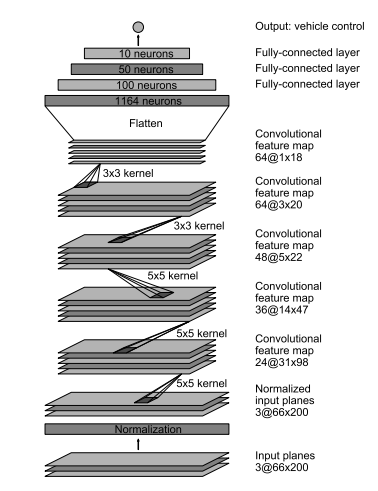

# Behavioral Cloning

## Objective

The goals / steps of this project are the following:
* Use the simulator to collect data of good driving behavior
* Build a convolution neural network in Keras that predicts steering angles from images
* Train and validate the model with a training and validation set
* Test that the model successfully drives around track one without leaving the road
* Summarize the results with a written report


## Files Submitted & Code Quality

My project includes the following files:
* model.py containing the script to create and train the model
* drive.py for driving the car in autonomous mode
* model.h5 containing a trained convolution neural network 
* track1_output_video.mp4 recording the screen when the simulator is running
* writeup_report.md summarizing the results

Using the Udacity provided simulator and my drive.py file, the car can be driven autonomously around the track by executing 
```sh
python drive.py model.h5
```

The model.py file contains the code for training and saving the convolution neural network. The file shows the pipeline I used for training and validating the model, and it contains comments to explain how the code works.

## Data Collection

To capture good driving behavior, I totally recorded 9 trips with different scenarios.

| Trip ID |     Scenario      | Number of frames |
| :-----: | :---------------: | :--------------: |
|  trip1  |  anti-clockwise   |      6,354       |
|  trip2  |     recovery      |      3,567       |
|  trip3  | counter-clockwise |      4,974       |
|  trip4  |  anti-clockwise   |      8,334       |
|  trip5  |     recovery      |      3,414       |
|  trip6  | counter-clockwise |      9,396       |
|  trip7  |  anti-clockwise   |      5,054       |
|  trip8  |     recovery      |      2,775       |
|  trip9  | counter-clockwise |      3,359       |
|  trip0  | udacity provided  |      24,108      |


To capture good driving behavior, I first recorded two laps on track one using center lane driving. Here is an example image of center lane driving:

![alt text][image2]

I then recorded the vehicle recovering from the left side and right sides of the road back to center so that the vehicle would learn to .... These images show what a recovery looks like starting from ... :

![alt text][image3]
![alt text][image4]
![alt text][image5]

Then I repeated this process on track two in order to get more data points.

To augment the data sat, I also flipped images and angles thinking that this would ... For example, here is an image that has then been flipped:

![alt text][image6]
![alt text][image7]

Etc ....

After the collection process, I had X number of data points. I then preprocessed this data by ...

## Model Architecture

####1. Solution Design Approach

The overall strategy for deriving a model architecture was to build a convolutional neural network system to  extract image freature and map it into a streering angle value. Basically, the whole system is a regression algorithm.

My first step was to use a convolution neural network model exactly same with LeNet. I thought this model might be appropriate because we do achieve good results on MNIST dataset and Germany Traffic Sign dataset.

Then I tried to use the architecture from Nvidia paper ["End-to-End Deep Learning for Self-Driving Cars"](https://arxiv.org/pdf/1604.07316.pdf) which used 3 convolutional layers and 3 fully-connected layers. 

Firstly, I used trip0 data provided by Udacity. In order to gauge how well the model was working, I split my image and steering angle data into a training and validation set. The final step was to run the simulator to see how well the car was driving around track one. There were a few spots where the vehicle fell off the track. In order to improve the driving behavior in these cases, I collected more data with different scenarios, such as recovery trip and counter-clockwise trip. The data set is described above.

At the end of the process, the vehicle is able to drive autonomously around the track without leaving the road.

####2. Final Model Architecture

The final model architecture is composed by one normalization layer, five convolutional layers, and three fully-connected layers with dropout (0.5 keep probability). The architecture is visualized as following figure:



## Training Strategy

- Data preprocessing and augmentation
- Randomly shuffled the dataset and slip dataset into training set and validation set. 
- Training with Adam optimizer (10 epochs)