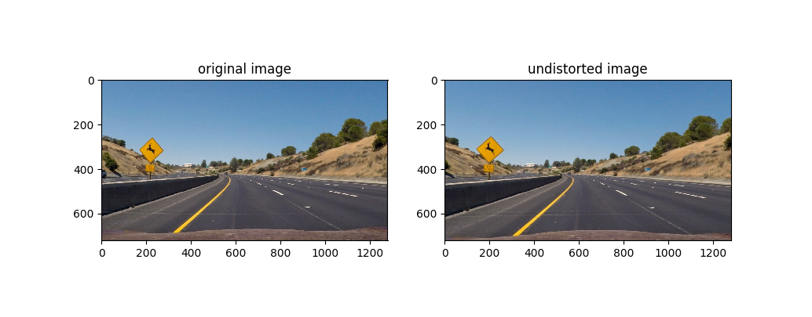
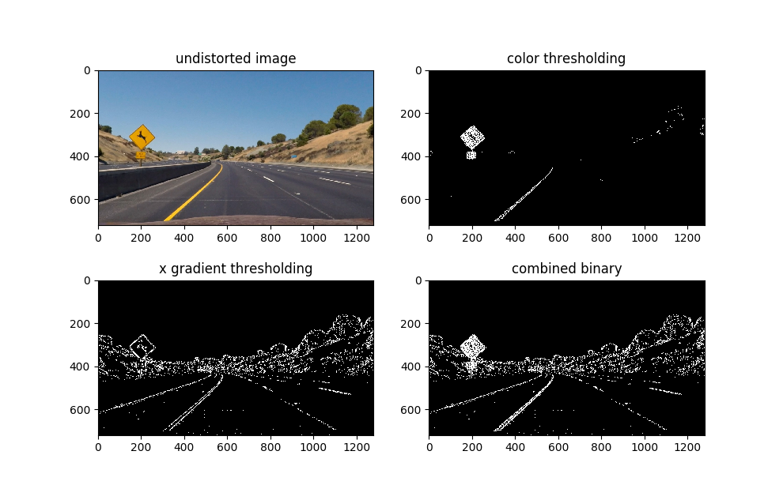
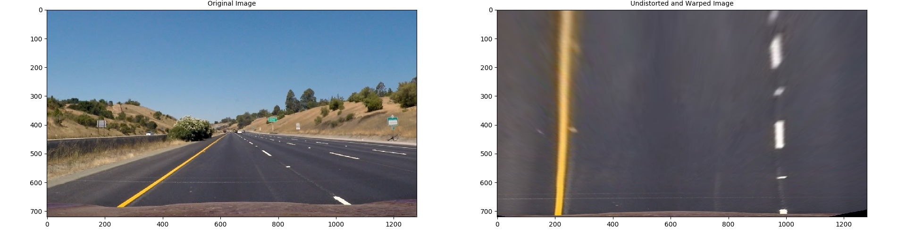
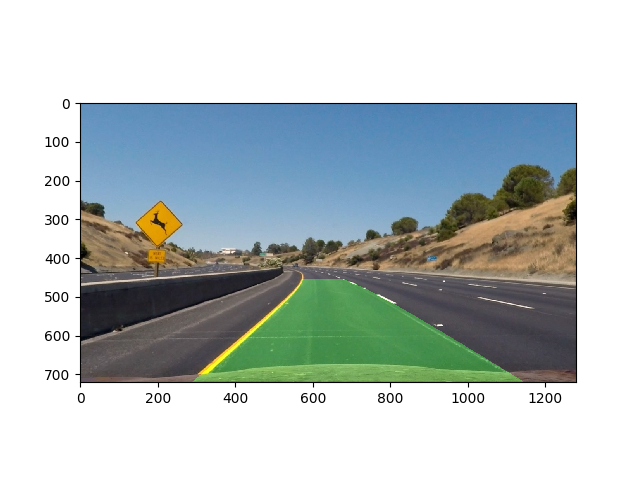

# Advanced Lane Detection

## Objective

The goals / steps of this project are the following:

* Compute the camera calibration matrix and distortion coefficients given a set of chessboard images.
* Apply a distortion correction to raw images.
* Use color transforms, gradients, etc., to create a thresholded binary image.
* Apply a perspective transform to rectify binary image ("birds-eye view").
* Detect lane pixels and fit to find the lane boundary.
* Determine the curvature of the lane and vehicle position with respect to center.
* Warp the detected lane boundaries back onto the original image.
* Output visual display of the lane boundaries and numerical estimation of lane curvature and vehicle position.

## Camera Calibration

The code for this step is contained in the `./Code/camera_calibration.py` file, and the calculated calibration parameters are stored into `calibration_params.pkl` for further steps.

I start by preparing "object points", which will be the (x, y, z) coordinates of the chessboard corners in the world. Here I am assuming the chessboard is fixed on the (x, y) plane at z=0, such that the object points are the same for each calibration image.  Thus, `objp` is just a replicated array of coordinates, and `objpoints` will be appended with a copy of it every time I successfully detect all chessboard corners in a test image .  `imgpoints` will be appended with the (x, y) pixel position of each of the corners in the image plane using the `cv2.findChessboardCorners()` function.  

I then used the output `objpoints` and `imgpoints` to compute the camera calibration and distortion coefficients using the `cv2.calibrateCamera()` function.  I applied this distortion correction to the test image using the `cv2.undistort()` function and obtained this result: 

## Pipeline (single images)

### 1. Distortion Correction

Firstly, load camera calibration parameters from `.pkl` file using `Pickle` package.

To demonstrate this step, I will describe how I apply the distortion correction using `cv2.undisort()` function to one of the test images like this one:

### 2. Binary Image Generation

I used a combination of color and gradient thresholds to generate a binary image (thresholding steps at lines 77 through 109 in `./Code/advanced_lane_detection.py`).  Here's an example of my output for this step. 

### 3. Perspective Transformation

The code for my perspective transform is in the `./Code/perspective_transform.py` file. This code takes as inputs an image (`img`), as well as source (`src`) and destination (`dst`) points.  I chose the hardcode the source and destination points in the following table:

|  Source   | Destination |
| :-------: | :---------: |
| 583, 455  |   200, 0    |
| 699, 455  |   1000, 0   |
| 193, 720  |  200, 720   |
| 1113, 720 |  1000, 720  |

The transform and inverse transform parameters were stored into `./Code/top_down_params.pkl` for further steps. And I verified that my perspective transform was working as expected by drawing the `src` and `dst` points onto a test image and its warped counterpart to verify that the lines appear parallel in the warped image.

### 4. Polynomial Fit for Lane Position

- Polynomial Fit by Sliding Windows

  Using sliding windows to search line pixels, and then fit polynomial lines based on all collected line pixels.

  

- Fast Polynomial Fit by Previous Detected Lines

  The processing speed can be boosted by searching line pixels based on a fixed margin aera of lines generated from previous frame. Just like the figure below:

- Sanity Check

  I implemented `sanity_check()` function in my code to check if

  - right line and left line have similar curvature
  - right line and left line are separated by approimatedly the correct distance horizontally
  - right line and left line are roughly parallel

  When processing the video, the frame will be fed to polynomial fit by sliding windows function once it fails by sanity check; otherwise, the frame will be fed to fast polynomial fit function in order to speed up processing time.

### 6. Radius of Curvature

I wrote a `curvature_estimate` function in `Line` class to calculate the radius of curvature by given line. Firstly, all line pixels were converted into world space. Then the coefficients of line in world space can be fitted. The radius of curvature was calculated by the equation: `Rcurve=(1+(2Ay+B)2)3/2 / ∣2A∣`

Therefore, we get the radius of curvature in meter.

### 8. Center Offset

The offset of vehicle's center is calculated by the difference between the center of vehicle's position and the center of two lines. The offset value descibes the distance in meter. If vehicle's center is closer to left line, the value is negative, and vice versa.

This part code is located at `process_pipeline()` function in `./Code/advanced_lane_detection.py` file. 

### 7. Draw Back

I implemented this step by  function in my code in `./Code/advanced_lane_detection.py` in the `remap()`.  Here is an example of my result on a test image:

## Pipeline (video)

Here's a [link to my video result](./project_video_output.mp4)

After finishing the pipeline for single image by `process_pipeline()` function in my code, I use `VideoFileClip().fl_image(process_pipeline)` to process video.

## Discussion

#### 1. Briefly discuss any problems / issues you faced in your implementation of this project.  Where will your pipeline likely fail?  What could you do to make it more robust?

I noticed that my traditional image processing approach was not able to handle part of `challenge_video.mp4` and `harder_challenge_video.mp4`. Even if I try to detect line on each frame using sliding windows, it still has many errors. Therefore, I think it is the problem on the ability of feature extraction of traditional image representation. Since we already know deep convolutional neural netwroks have magic ability of image feature extraction and representation, I prefer to use CNN to extract image feature and detet where the lines locate. Some datasets like [Synthia](http://synthia-dataset.net/) should hopefully provide enough lane marking annotation to train a deep convolutional neural network.