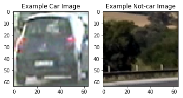
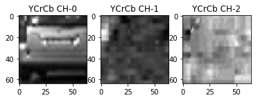
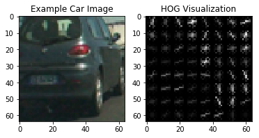
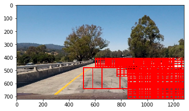
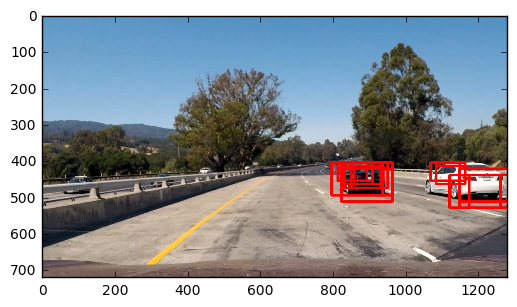
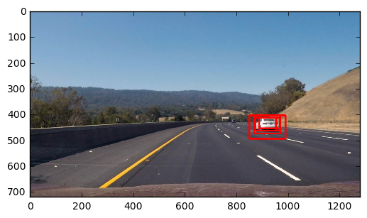
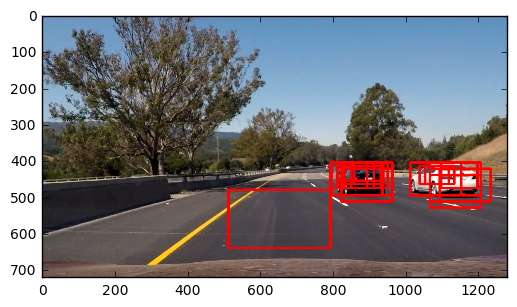
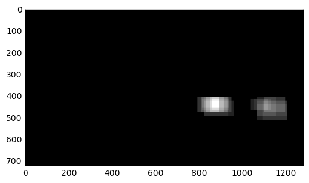
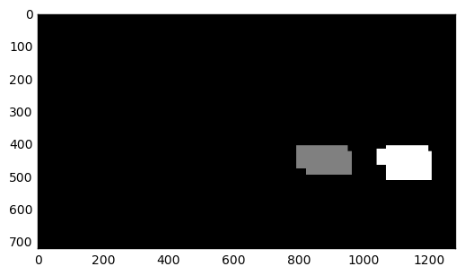
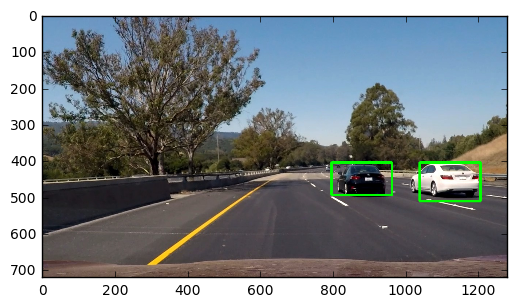

# Vehicle Detection

[](http://www.udacity.com/drive)

## Objective

The goals / steps of this project are the following:

* Perform a Histogram of Oriented Gradients (HOG) feature extraction on a labeled training set of images and train a classifier Linear SVM classifier
* Optionally, you can also apply a color transform and append binned color features, as well as histograms of color, to your HOG feature vector. 
* Note: for those first two steps don't forget to normalize your features and randomize a selection for training and testing.
* Implement a sliding-window technique and use your trained classifier to search for vehicles in images.
* Run your pipeline on a video stream (start with the test_video.mp4 and later implement on full project_video.mp4) and create a heat map of recurring detections frame by frame to reject outliers and follow detected vehicles.
* Estimate a bounding box for vehicles detected.

## Histogram of Oriented Gradients (HOG)

The code for this step is contained at the `get_hog_features()` function in the `code/utils.py` file.

I started by reading in all the `vehicle` and `non-vehicle` images.  Here is an example of one of each of the `vehicle` and `non-vehicle` classes:



I then explored different color spaces and different `skimage.hog()` parameters (`orientations`, `pixels_per_cell`, and `cells_per_block`).  I grabbed random images from each of the two classes and displayed them to get a feel for what the `skimage.hog()` output looks like.

Here is an example using the `YCrCb` color space and HOG parameters of `orientations=9`, `pixels_per_cell=(8, 8)` and `cells_per_block=(2, 2)`:






**Final choice of HOG parameters**

I tried various combinations of parameters and finally the parameters are set as following:

```

params_config = {
    'color_space': 'YCrCb',      # Can be RGB, HSV, LUV, HLS, YUV, YCrCb
    'orient': 9,                 # HOG orientations
    'pix_per_cell': 8,           # HOG pixels per cell
    'cell_per_block': 2,         # HOG cells per block
    'hog_channel': 'ALL',        # Can be 0, 1, 2, or "ALL"
    'spatial_size': (32, 32),    # Spatial binning dimensions
    'hist_bins': 16,             # Number of histogram bins
    'spatial_feat': True,        # Spatial features on or off
    'hist_feat': True,           # Histogram features on or off
    'hog_feat': True,            # HOG features on or off
}
```

**Model Training Pipeline**

- load all car and not-car data
- extract image feature by using HOG and color histogram
- feed all features of car image and not-car image to a linear SVM to train a model

I trained a linear SVM using `sklearn` package. The model training code is in the `code/model.py` file. And all useful functions are in the `code/utils.py` file. 

## Sliding Window Search

I decided to search multiple scale windows positions over part of the image and came up with this:



Based on my experiences, I decided to use windows size with (80, 50), (90, 60), (100, 50), (120, 60), (150, 125), (200, 150), (250, 135); and the start/stop x/y points are hands-on selected. For usual driving environment, the object becomes smaller when it far away with you. Therefore, the closer the object with you, the larger the size of object appears. That's why I choose 0.8 overlap ratio for larger window size and 0.6 overlap ratio for smaller window size. This part of code is in `code/config.py` file.

Ultimately I searched on two scales using YCrCb 3-channel HOG features plus spatially binned color and histograms of color in the feature vector, which provided a nice result.  

Again the parameters are set as following for :

```params_config = {
params_config = {
    'color_space': 'YCrCb',      # Can be RGB, HSV, LUV, HLS, YUV, YCrCb
    'orient': 9,                 # HOG orientations
    'pix_per_cell': 8,           # HOG pixels per cell
    'cell_per_block': 2,         # HOG cells per block
    'hog_channel': 'ALL',        # Can be 0, 1, 2, or "ALL"
    'spatial_size': (32, 32),    # Spatial binning dimensions
    'hist_bins': 16,             # Number of histogram bins
    'spatial_feat': True,        # Spatial features on or off
    'hist_feat': True,           # Histogram features on or off
    'hog_feat': True,            # HOG features on or off
}
```

Here are some example images:






In order to get more reliable detection result, I set the threshold of classification score to 0.7, which can reduce some false positive.

## Video Implementation

Here's a [link to my video result](./project_video_output.mp4)

I recorded the positions of positive detections in each frame of the video.  From the positive detections I created a heatmap and then thresholded that map to identify vehicle positions.  I then used `scipy.ndimage.measurements.label()` to identify individual blobs in the heatmap.  I then assumed each blob corresponded to a vehicle.  I constructed bounding boxes to cover the area of each blob detected.  

Here's an example result showing the heatmap from a series of frames of video (10 frames), and threshold the heatmap, and the result of `scipy.ndimage.measurements.label()` , and the bounding boxes then overlaid on the last frame of video:









## Discussion

In this project, the main problem I faced is how to define the strategy to search the position of car. There are too many hardcode in my program, such as the window size, window scale, start and stop position of (x, y). It may not generalize very well.

Another thing is that the feature used is based on traditional image processing algorithm. The parameters chosen may not work for other videos.

In addition, the processing speed is very slow. It took almost half hour to generate the result of example video.

In order to make the system more robust, I would like to try deep learning algorithms, such as Faster RCNN, YOLO, or SSD. Especially for YOLO and SSD, they are very fast and accurate algorithm.

